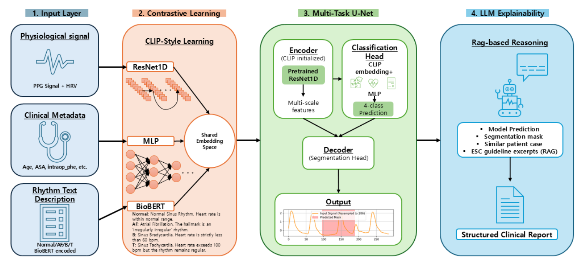

# PPG Arrhythmia Detection

PPG(광혈류측정) 신호에서 부정맥을 탐지하는 딥러닝 시스템으로, 하이브리드 ResNet1D + U-Net 아키텍처와 CLIP 기반 대조 학습, Gemini LLM 기반 임상 보고서 생성기를 결합합니다.

---

## 개요

이 프로젝트는 원시 PPG 파형에서 4가지 심장 리듬 클래스를 탐지합니다:

| 레이블 | 상태 |
|--------|------|
| Normal | 동성 리듬, HR 60–100 bpm |
| AF | 심방세동 (Atrial Fibrillation) |
| B | 서맥 — Bradycardia (HR < 60 bpm) |
| T | 빈맥 — Tachycardia (HR > 100 bpm) |

또한 파형에 대한 **이진 이상 세그멘테이션 마스크**를 생성하여 분류에 기여한 영역을 강조합니다.

---

## 아키텍처



### 1. CLIP 사전학습
ResNet1D 인코더는 PPG 신호 표현을 13차원 임상 테이블 특징(나이, BMI, 검사 수치, 동반질환 등)과 정렬하기 위해 대조 학습(CLIP 방식)으로 사전학습됩니다.

### 2. 하이브리드 ResNet1D + U-Net (메인 모델)
- **인코더**: SE(Squeeze-and-Excitation) 블록을 포함한 CLIP 사전학습 ResNet1D
- **분류 헤드**: 글로벌 평균 풀링 → 4-클래스 소프트맥스
- **디코더**: U-Net 스킵 연결 디코더 → 이진 세그멘테이션 마스크

### 3. 멀티모달 입력
| 입력 | 상세 |
|------|------|
| PPG 파형 | 286 샘플로 리샘플링, 샘플별 Z-score 정규화 |
| HRV 특징 | HR(bpm), SDNN, RMSSD, pNN50 — PPG 피크에서 추출한 4가지 특징 |
| 임상 특징 | 13가지 특징: 나이, BMI, 수술 시간, 검사 수치 (Na, BUN, Cr, K, 에페드린, 페닐에프린 용량), 성별, 응급 수술 여부, 당뇨, 고혈압 |

### 4. LLM 보고서 생성 (RAG + Vision)
- **RAG**: CLIP 임상 임베딩을 통한 유사 환자 검색 + ESC/ACC/AHA 의료 가이드라인 내장
- **Vision**: 원시 PPG 파형 이미지의 Gemini 멀티모달 분석
- **Model**: `gemini-flash-latest`

---

## 프로젝트 구조

```
ppg_arrhythmia_detection/
├── model_architecture.py      # 모델 클래스, HRV 추출, 전처리 (공유)
├── contrastive_learning.py    # argparse CLI를 포함한 CLIP 사전학습 파이프라인
├── train.py                   # argparse CLI를 포함한 학습 파이프라인
├── app.py                     # Streamlit 웹 애플리케이션
├── llm_utils.py               # Gemini LLM 설정, RAG 인코더, 의료 가이드라인
├── images/                    # README 이미지
│   └── Overview.png
├── requirements.txt
├── .gitignore
└── LICENSE
```


## 설치

```bash
pip install -r requirements.txt
```

Python 3.9+ 및 PyTorch (CPU 또는 CUDA)가 필요합니다.

---

## 학습

```bash
python train.py \
  --base_path /path/to/project \
  --dataset_path /path/to/PPG_AD_Dataset \
  --clip_weights /path/to/clip_checkpoint.pth \
  --save_path /path/to/save/model.pth
```

### 주요 인수

| 인수 | 기본값 | 설명 |
|------|--------|------|
| `--epochs` | 200 | 총 학습 에폭 |
| `--batch_size` | 32 | 배치 크기 |
| `--lr` | 5e-5 | 기본 학습률 |
| `--enc_lr_ratio` | 0.1 | 인코더 학습률 배수 (파인튜닝) |
| `--unfreeze_epoch` | 50 | 인코더가 해제되는 에폭 |
| `--patience` | 50 | 조기 종료 인내값 |
| `--alpha` | 2.0 | 분류 손실 가중치 |
| `--beta` | 0.8 | 세그멘테이션 손실 가중치 |
| `--seed` | 42 | 랜덤 시드 |

---

## 웹 애플리케이션

```bash
streamlit run app.py
```

1. 프로젝트 루트에 Gemini API 키를 포함한 `.env` 파일을 생성합니다:
   ```
   GEMINI_API_KEY=your_key_here
   ```
2. 환자 임상 데이터로 등록 또는 로그인합니다.
3. `.npy` 또는 `.npz` PPG 파일을 업로드합니다.
4. 앱은 슬라이딩 윈도우로 신호를 스캔하고, 각 세그먼트를 분류하며, LLM 임상 보고서를 생성합니다.

앱 실행 전 다음 파일을 프로젝트 루트에 위치시킵니다:

| 파일 | 설명 |
|------|------|
| `best_combined_model.pth` | 학습된 UNet 모델 가중치 (`train.py` 출력) |
| `clip_biobert_hyh_xai.pth` | RAG 임상 인코더용 CLIP 체크포인트 |
| `knowledge_base.pt` | 사전 구축된 RAG 지식 베이스 (`contrastive_learning.py` 출력) |

---